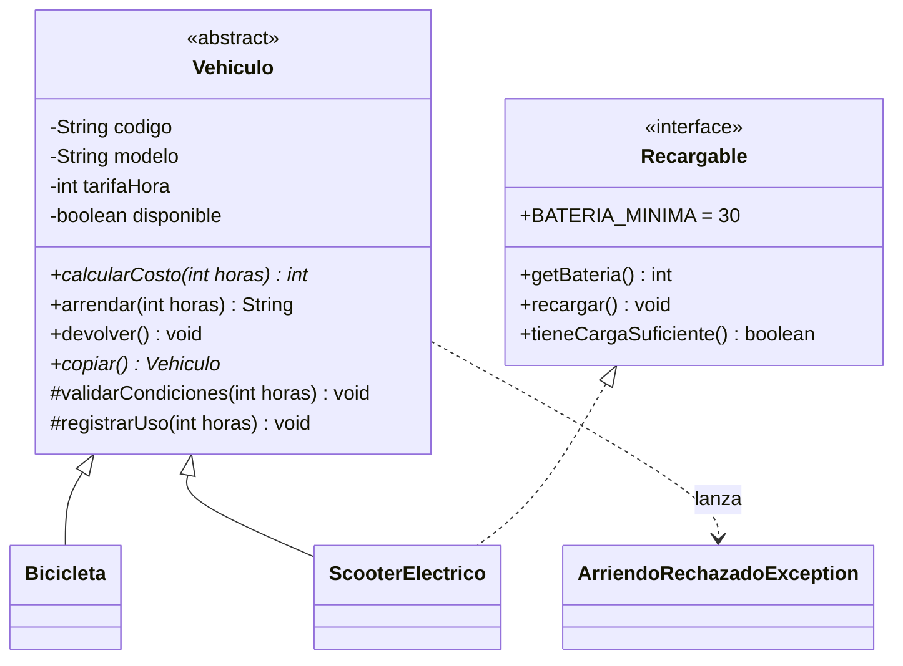

# Caso completo 01 · Arriendo Cerro Alegre

**DSY1102 · Programación Orientada a Objetos · Caso de práctica tipo Evaluación Parcial 2**

> Material de práctica, similar a la tarea de la Fonda San Belarmino. La guía de resolución y la implementación de referencia están en la rama `solucion` (`GUIA.md` en esta carpeta).

| | |
|---|---|
| **Indicadores** | IL 2.1 al IL 2.8 |
| **Tiempo estimado** | 3 a 4 bloques |
| **Tecnologías** | Java 25 · Maven · JavaFX 25 · FXML / Scene Builder · Jackson |
| **Temas** | Herencia, clases abstractas, interfaces, excepciones propias, MVC, `TableView`, navegación con paso de parámetros, validación, Repository + DAO, JSON |

---

## 1. Contexto

**Arriendo Cerro Alegre** arrienda bicicletas y scooters eléctricos por hora a turistas en Valparaíso. Hoy anotan todo en un cuaderno. El modelo de negocio ya está programado y funciona por consola (`Main`). Se necesita una **aplicación de escritorio** que permita al encargado del local:

- ver la flota en una tabla, buscar por código o modelo y filtrar solo los disponibles;
- registrar, editar y eliminar vehículos mediante un formulario que no acepte datos incompletos o inválidos;
- arrendar un vehículo por horas, aplicando las reglas del negocio, y registrar su devolución;
- recargar la batería de los scooters;
- conservar la información entre jornadas en un archivo **JSON**.

## 2. Reglas del negocio (ya implementadas en `model/`)

| Concepto | Regla |
|---|---|
| Código | Formato `AA-00` (ej.: `BK-01`), único en la flota. |
| Tarifa por hora | Entre $500 y $20.000. |
| Horas de arriendo | Entre 1 y 8. |
| Disponibilidad | No se arrienda un vehículo ya arrendado ni se devuelve uno disponible. |
| **Bicicleta** | Costo = tarifa × horas. Desde **4 horas**, **20 % de descuento**. Categoría: Urbana, Montaña o Paseo. Puede tener canasto. |
| **Scooter eléctrico** (`Recargable`) | Costo = tarifa × horas + **seguro de $1.000**. Se arrienda solo con batería **≥ 30 %** y gasta **10 % por hora**. Batería de 0 a 100 y autonomía de 5 a 120 km. |

Mensajes del modelo:

```
Arriendo autorizado: BK-01 por 2 h | Total: $5.000
Arriendo rechazado: BK-01 ya está arrendado.
Arriendo rechazado: SC-02 tiene 15% de batería (mínimo 30%).
Arriendo rechazado: las horas deben estar entre 1 y 8.
```



`copiar()` retorna una copia independiente del vehículo. Úsala para aplicar un cambio (arrendar, devolver, recargar, editar) **sin tocar el original hasta que el cambio quede guardado**.

## 3. Arquitectura esperada

| Paquete | Contenido | Responsabilidad |
|---|---|---|
| `cl.dsy1102.arriendo` | `AppFX`, `Navegador`, `Main` | Arranque, ciclo de vida y navegación. |
| `...model` | Resuelto (completar según R2) | Datos y reglas del negocio. |
| `...dao` | `VehiculoDao`, `JsonVehiculoDao`, `PersistenciaException` | Leer y escribir el JSON. Única capa que conoce el archivo. |
| `...repository` | `Repository<T>`, `VehiculoRepository` | `ObservableList` + CRUD que persiste en cada cambio. |
| `...controller` | Un controlador por vista (+ `Alertas`) | Leer campos, validar, mostrar mensajes, navegar y delegar. |
| `resources/.../view` | `principal-view.fxml`, `formulario-view.fxml`, `arriendo-view.fxml`, `styles.css` | Estructura visual. |

---

## 4. Requerimientos

### R1. Proyecto y ciclo de vida
- El `pom.xml` y el `module-info.java` ya están configurados. Revisa para qué sirve cada dependencia y cada `opens`.
- `AppFX` traza por consola `init()`, `start()` y `stop()` y usa el `Stage` que recibe `start()`.

### R2. Modelo listo para JSON y para la tabla
- Agrega a `Vehiculo` el método abstracto `obtenerTipo()`, que retorna `"Bicicleta"` o `"Scooter"`, para mostrarlo en la tabla sin preguntar por la clase concreta. Inclúyelo al inicio de `obtenerDetalle()`.
- Prepara el modelo para Jackson: un constructor sin parámetros en cada clase, el registro de subtipos (`"tipo": "BICICLETA"` / `"SCOOTER"`) y la persistencia de `disponible`, que **no** tiene *setter* público.

### R3. Vista principal
- `TableView` con **Tipo, Código, Modelo, Tarifa/hora, Estado y Batería**. La tarifa se muestra como `$2.500`. Batería muestra `80%` para los scooters y `—` para las bicicletas. Estado aparece en verde (*Disponible*) o en rojo (*Arrendado*).
- Búsqueda en tiempo real por código o modelo, y un `CheckBox` **Solo disponibles**. El ordenamiento por columna debe seguir funcionando.
- Contador `X de Y vehículos`.
- Botones **Nuevo, Editar, Eliminar, Arrendar, Devolver, Recargar**. Sin una fila seleccionada se muestra un `Alert`. Doble clic sobre una fila abre la edición.
- **Eliminar** pide confirmación y no permite eliminar un vehículo arrendado.
- **Recargar** solo aplica a vehículos `Recargable`. La pregunta se hace a la interfaz, no a la clase.

### R4. Formulario (crear y editar)
- Una sola vista. `ComboBox` de tipo. Según el tipo se muestran los campos de bicicleta (categoría, canasto) o de scooter (batería, autonomía).
- Al editar, el tipo y el código no se pueden modificar y el vehículo **conserva su estado** (si estaba arrendado, sigue arrendado).
- No se puede registrar un código repetido.

### R5. Arriendo
- Recibe el vehículo seleccionado y muestra su ficha (`obtenerDetalle()`).
- Campo **Horas** con el costo estimado, que se actualiza mientras se escribe.
- **Arrendar** muestra en pantalla el mensaje del modelo (autorizado en verde, rechazado en rojo) y, si se autorizó, guarda el cambio (el vehículo queda *Arrendado* y el scooter con menos batería).
- Las reglas se resuelven en el modelo, no en el controlador.

### R6. Persistencia JSON (Repository + DAO)
- Archivo `data/vehiculos.json`. **Solo `AppFX` y el DAO conocen esa ruta.**
- `Repository<T>` genérico con `cargar`, `listar`, `agregar`, `actualizar` y `eliminar`. `VehiculoRepository` **guarda en el archivo después de cada cambio**, incluidos arrendar, devolver y recargar.

| Situación | Comportamiento esperado |
|---|---|
| El archivo no existe | Lista vacía, sin error. |
| La carpeta `data/` no existe | Se crea al guardar. |
| Archivo dañado o con datos inválidos | `PersistenciaException` → `Alert` y la aplicación sigue con la tabla vacía. |
| No se puede escribir | `PersistenciaException` → `Alert`. **La tabla no muestra un cambio que no se guardó.** |

### R7. Validación y errores
- El controlador valida antes de operar: campos vacíos, números no convertibles y opciones sin elegir, con **todos** los errores en un solo `Alert` y los campos marcados en rojo.
- Los rangos los valida el modelo (`IllegalArgumentException`) y su mensaje se muestra. La aplicación nunca se cae.
- Ningún controlador captura `IOException`.

### R8. Navegación
- `Navegador` centraliza el cambio de vista con `FXMLLoader` sobre el `Stage` principal y retorna el controlador de destino para entregarle datos.
- Flujos: Principal ↔ Formulario y Principal ↔ Arriendo, sin excepciones en consola.

---

## 5. Datos de prueba

| Tipo | Código | Modelo | Tarifa | Específico |
|---|---|---|---|---|
| Bicicleta | BK-01 | Oxford Urbana | 2500 | Urbana · con canasto |
| Bicicleta | BK-02 | Trek Marlin | 3500 | Montaña |
| Scooter | SC-01 | Xiaomi 4 Pro | 3000 | Batería 80 · Autonomía 45 |
| Scooter | SC-02 | Segway E2 | 2800 | Batería 15 · Autonomía 25 |

Pruebas que usará el docente:

1. Guardar el formulario vacío. Luego, código `X1`, tarifa `abc` y tarifa `100`. Registrar `BK-01` por segunda vez.
2. Arrendar BK-02 por 5 h → `$14.000`. Intentar arrendarla de nuevo.
3. Arrendar SC-02 → rechazado por batería. *Recargar* y arrendar 3 h → `$9.400` y batería 70 %.
4. Editar la tarifa de un vehículo arrendado: debe seguir *Arrendado*.
5. Cerrar y abrir la aplicación: la flota, los estados y las baterías se conservan.
6. Borrar `data/vehiculos.json` → la aplicación inicia vacía. Escribir texto inválido en el archivo → `Alert` sin cierre.

## 6. Cómo ejecutar

```bash
mvn compile exec:java    # demostración del modelo por consola
mvn javafx:run           # aplicación gráfica
```

## 7. Autoevaluación

| Dimensión | Pregunta de control |
|---|---|
| Estabilidad | ¿La aplicación navega entre todas las pantallas sin excepciones? |
| Cohesión | ¿Los controladores solo tienen lógica de interfaz y delegan en el repositorio y el modelo? |
| Usabilidad y validación | ¿Impide datos incompletos o erróneos e informa qué corregir? |
| Persistencia | ¿Subtipo, estado y batería se conservan al reiniciar? ¿Un fallo de escritura deja la tabla sin cambios? |
| Control de versiones | ¿El historial muestra commits por capa? |

Criterios adicionales: ningún controlador contiene `File`, `Path`, `ObjectMapper` ni el nombre `vehiculos.json`. Los cambios se hacen sobre la `ObservableList`, nunca sobre las filas de la tabla.
