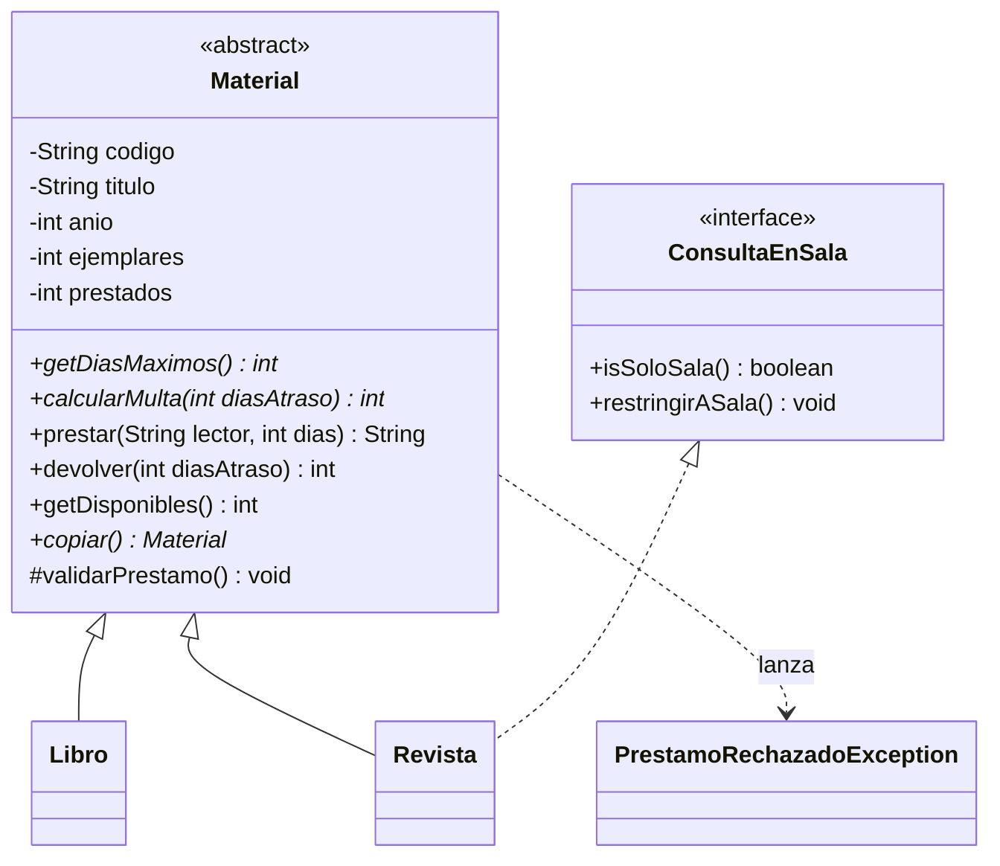

# Caso completo 02 · Biblioteca Gabriela Mistral

**DSY1102 · Programación Orientada a Objetos · Caso de práctica tipo Evaluación Parcial 2**

> Material de práctica, similar a la tarea de la Fonda San Belarmino. La guía de resolución y la implementación de referencia están en la rama `solucion` (`GUIA.md` en esta carpeta).

| | |
|---|---|
| **Indicadores** | IL 2.1 al IL 2.8 |
| **Tiempo estimado** | 3 a 4 bloques |
| **Tecnologías** | Java 25 · Maven · JavaFX 25 · FXML / Scene Builder · Jackson |
| **Temas** | Herencia, clases abstractas, interfaces, excepciones propias, MVC, `TableView` con celdas personalizadas, filtros combinados, `Spinner`, `TextInputDialog`, navegación, validación, Repository + DAO, JSON |

---

## 1. Contexto

La **Biblioteca Municipal Gabriela Mistral** presta libros y revistas a domicilio. Hoy el registro se lleva en fichas de papel. El modelo de negocio ya está programado y funciona por consola (`Main`). Se necesita una **aplicación de escritorio** que permita a la bibliotecaria:

- ver la colección, buscar por título o código y filtrar por tipo;
- registrar, editar y eliminar materiales con un formulario que no acepte datos incompletos o inválidos;
- prestar un material a un lector por una cantidad de días, según las reglas del tipo;
- registrar devoluciones y calcular la multa por atraso;
- conservar la colección y los préstamos entre jornadas en un archivo **JSON**.

## 2. Reglas del negocio (ya implementadas en `model/`)

| Concepto | Regla |
|---|---|
| Código | Formato `AAA-000` (ej.: `LIB-001`), único en la colección. |
| Año | Entre 1450 y el año actual. |
| Ejemplares | Entre 1 y 20. **No puede quedar por debajo de los ejemplares prestados.** |
| Préstamo | Requiere el nombre del lector y que quede al menos un ejemplar disponible. |
| **Libro** | Autor y páginas (1 a 5000). Préstamo de 1 a **14 días**. Multa de **$200 por día** de atraso. |
| **Revista** (`ConsultaEnSala`) | Número (1 a 999). Préstamo de 1 a **3 días**. Multa de **$100 por día**. Puede quedar restringida a **consulta en sala**: así no se presta y la restricción no se puede quitar. |

Mensajes del modelo:

```
Préstamo autorizado: "Desolación" a Ana Rojas por 14 días | Quedan 1 de 2
Préstamo rechazado: este material se presta entre 1 y 14 días.
Préstamo rechazado: no quedan ejemplares disponibles de "Sub terra".
Préstamo rechazado: "Anales de la Universidad de Chile" es de consulta en sala.
Préstamo rechazado: indica el nombre del lector.
Devolución de LIB-002 registrada | Multa: $600
```



`copiar()` retorna una copia independiente. Úsala para aplicar un cambio (prestar, devolver, editar) **sin tocar el original hasta que el cambio quede guardado**.

## 3. Arquitectura esperada

| Paquete | Contenido | Responsabilidad |
|---|---|---|
| `cl.dsy1102.biblioteca` | `AppFX`, `Navegador`, `Main` | Arranque, ciclo de vida y navegación. |
| `...model` | Resuelto (completar según R2) | Datos y reglas. |
| `...dao` | `MaterialDao`, `JsonMaterialDao`, `PersistenciaException` | Leer y escribir el JSON. |
| `...repository` | `Repository<T>`, `MaterialRepository` | `ObservableList` + CRUD que persiste en cada cambio. |
| `...controller` | Un controlador por vista (+ `Alertas`) | Lógica de interfaz. |
| `resources/.../view` | `principal-view.fxml`, `formulario-view.fxml`, `prestamo-view.fxml`, `styles.css` | Estructura visual. |

---

## 4. Requerimientos

### R1. Proyecto y ciclo de vida
- Revisa `pom.xml` y `module-info.java`. `AppFX` traza `init()`, `start()` y `stop()` y usa el `Stage` recibido.

### R2. Modelo listo para JSON y para la tabla
- Agrega a `Material` el método abstracto `obtenerTipo()` (`"Libro"` / `"Revista"`) y úsalo al inicio de `obtenerDetalle()`.
- Prepara el modelo para Jackson: constructores sin parámetros, registro de subtipos (`"tipo": "LIBRO"` / `"REVISTA"`), y persistencia de `prestados` y `soloSala`, que **no** tienen *setter*.
- **Cuidado:** `getDisponibles()` y `getDiasMaximos()` son **valores calculados**. Si Jackson los escribe en el archivo, la aplicación guarda sin problemas pero **no puede volver a abrirse**. Exclúyelos.

### R3. Vista principal
- `TableView` con **Tipo, Código, Título, Año, Disponibles y Préstamo**:
  - *Disponibles* muestra `2 de 3`, en rojo cuando es `0 de N`, y ordena por la cantidad disponible;
  - *Préstamo* muestra `Hasta 14 días`, `Hasta 3 días` o `Solo sala`. Esta última se decide preguntando a la interfaz `ConsultaEnSala`.
- Búsqueda en tiempo real por título o código, combinada con un `ComboBox` **Todos / Libro / Revista**. El ordenamiento por columna debe seguir funcionando.
- Contador `X de Y materiales`.
- Botones **Nuevo, Editar, Eliminar, Prestar, Devolver**. Sin una fila seleccionada se muestra un `Alert`. Doble clic sobre una fila abre la edición. **Eliminar** pide confirmación y no permite eliminar un material con ejemplares prestados.

### R4. Formulario (crear y editar)
- Una sola vista con campos específicos según el tipo (libro: autor y páginas; revista: número y *solo sala*).
- Al editar, tipo y código no se modifican, los préstamos se conservan y una revista restringida no se puede liberar.

### R5. Préstamo
- Recibe el material y muestra su ficha.
- `TextField` para el lector y `Spinner` de días, **cuyo máximo depende del tipo** (14 o 3).
- **Prestar** muestra el mensaje del modelo (verde o rojo) y, si se autorizó, guarda el cambio y actualiza la ficha. Se pueden registrar varios préstamos seguidos.

### R6. Devolución
- **Devolver** abre un `TextInputDialog` que pide los días de atraso (`0` por defecto). Si el usuario cancela, no pasa nada.
- Un texto no numérico o un número negativo se informan con un `Alert`. Si la devolución procede, se guarda y se informa la multa: `Multa a pagar: $600 (3 días de atraso).` o `Sin multa.`.

### R7. Persistencia JSON (Repository + DAO)
- Archivo `data/materiales.json`. Solo `AppFX` y el DAO conocen la ruta.
- `MaterialRepository` guarda después de cada cambio (incluidos préstamos y devoluciones) y rechaza códigos repetidos.
- Mismos casos borde que la Fonda: archivo inexistente, carpeta inexistente, archivo dañado (`Alert` y tabla vacía) y error de escritura (`Alert`, sin cambios en la tabla).

### R8. Validación, errores y navegación
- Validación en dos niveles: el controlador revisa campos vacíos y números; el modelo, rangos y formatos. Todos los errores juntos y los campos marcados en rojo.
- Ningún controlador captura `IOException`.
- `Navegador` con paso de parámetros. Flujos: Principal ↔ Formulario y Principal ↔ Préstamo.

---

## 5. Datos de prueba

| Tipo | Código | Título | Año | Ejemplares | Específico |
|---|---|---|---|---|---|
| Libro | LIB-001 | Desolación | 1922 | 2 | Gabriela Mistral · 248 páginas |
| Libro | LIB-002 | Sub terra | 1904 | 1 | Baldomero Lillo · 180 páginas |
| Revista | REV-001 | Revista Musical Chilena | 2024 | 3 | Número 241 |
| Revista | REV-002 | Anales de la Universidad de Chile | 2023 | 1 | Número 23 · solo sala |

Pruebas que usará el docente:

1. Formulario vacío. Luego: año `2999`, páginas `cien`, código `LIB-001` repetido.
2. Prestar *Desolación* sin lector, luego a Ana y a Bruno, y un tercer préstamo (sin ejemplares).
3. Prestar *Anales* → consulta en sala. El `Spinner` de una revista llega como máximo a 3.
4. Devolver *Desolación* con `3` días de atraso → `$600`. Con `-1` o `abc` → `Alert`.
5. Editar *Desolación* con 2 ejemplares prestados e intentar dejar **1** ejemplar → rechazado.
6. Cerrar y abrir: préstamos y restricciones se conservan. El archivo **no** contiene `disponibles` ni `diasMaximos`.
7. JSON dañado → `Alert` sin cierre.

## 6. Cómo ejecutar

```bash
mvn compile exec:java    # demostración del modelo por consola
mvn javafx:run           # aplicación gráfica
```

## 7. Autoevaluación

| Dimensión | Pregunta de control |
|---|---|
| Estabilidad | ¿Navega entre todas las pantallas y diálogos sin excepciones? |
| Cohesión | ¿Las reglas (plazos, multas, sala) están en el modelo y no en los controladores? |
| Usabilidad y validación | ¿Impide datos erróneos e informa qué corregir? |
| Persistencia | ¿La aplicación vuelve a abrir sus propios datos? ¿Se conservan préstamos y restricciones? |
| Control de versiones | ¿Commits por capa? |
