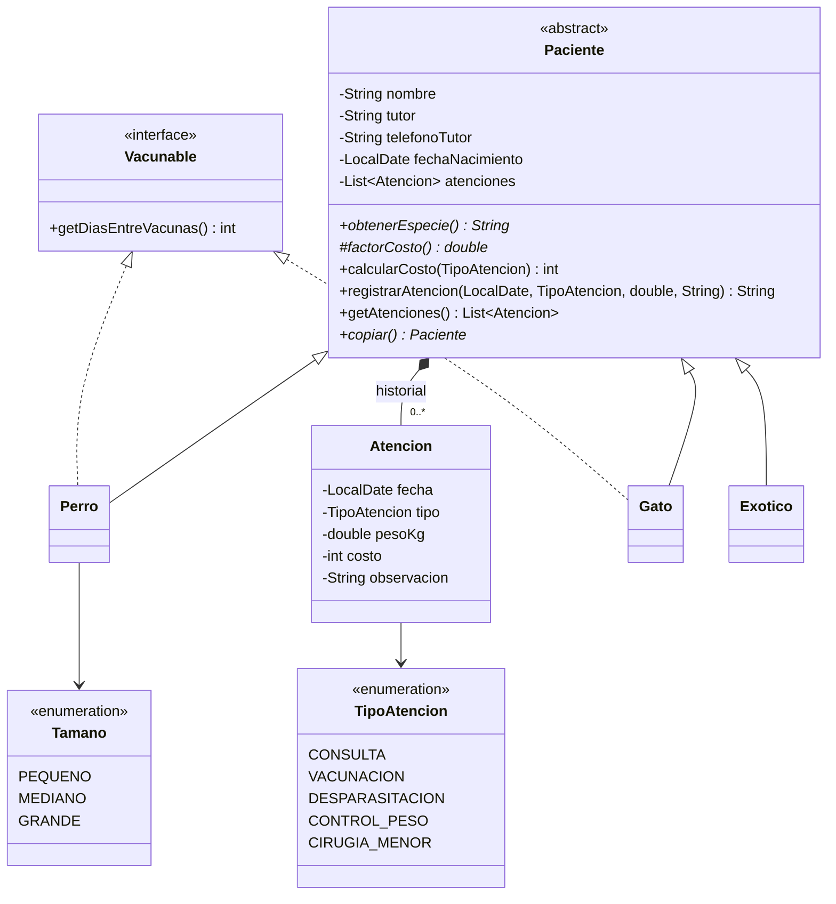

# Caso completo 03 · Clínica Veterinaria Patitas del Sur

**DSY1102 · Programación Orientada a Objetos · Caso de práctica tipo Evaluación Parcial 2**

> Material de práctica, similar a la tarea de la Fonda San Belarmino. La guía de resolución y la implementación de referencia están en la rama `solucion` (`GUIA.md` en esta carpeta).

| | |
|---|---|
| **Indicadores** | IL 2.1 al IL 2.8 |
| **Tiempo estimado** | 4 bloques |
| **Tecnologías** | Java 25 · Maven · JavaFX 25 · FXML / Scene Builder · Jackson + `jackson-datatype-jsr310` |
| **Temas** | Herencia, clases abstractas, interfaces, **enums con atributos**, **composición** (historial dentro del paciente), **fechas** (`LocalDate`, `DatePicker`), vista **maestro-detalle**, MVC, navegación, validación, Repository + DAO, JSON anidado |

---

## 1. Contexto

La **Clínica Veterinaria Patitas del Sur**, en Puerto Varas, atiende perros, gatos y mascotas exóticas. Las fichas clínicas están en carpetas de papel. El modelo ya está programado y funciona por consola (`Main`). Se necesita una **aplicación de escritorio** para la recepción que permita:

- ver los pacientes, buscar por nombre del paciente o del tutor y filtrar por especie;
- registrar, editar y eliminar pacientes;
- abrir la **ficha clínica** de un paciente, ver su **historial de atenciones** y registrar una nueva atención (fecha, tipo, peso y observación), aplicando las reglas clínicas;
- conservar pacientes **e historiales** entre jornadas en un archivo **JSON**.

## 2. Reglas del negocio (ya implementadas en `model/`)

**Servicios (`enum TipoAtencion`)**

| Servicio | Precio base |
|---|---|
| Consulta general | $15.000 |
| Vacunación | $12.000 |
| Desparasitación | $9.000 |
| Control de peso | $6.000 |
| Cirugía menor | $85.000 |

**Costo según el paciente**

| Paciente | Costo | Vacunas |
|---|---|---|
| **Perro** (`Vacunable`) | Precio base × factor del tamaño (`enum Tamano`: pequeño 1,0 · mediano 1,2 · grande 1,5) | Mínimo 21 días entre vacunas |
| **Gato** (`Vacunable`) | Precio base | Mínimo 28 días entre vacunas |
| **Exótico** (conejo, hurón o ave) | Precio base × 1,3 (manejo especial) | **No** se vacunan en la clínica |

**Reglas de una atención**: fecha obligatoria, no futura y no anterior al nacimiento; peso entre 0,05 y 120 kg; observación opcional de hasta 200 caracteres. El costo se calcula y **se guarda** al registrar la atención (si los precios cambian, el historial no cambia). Un mismo tutor no puede tener dos pacientes con el mismo nombre.

Mensajes del modelo:

```
Atención registrada: Vacunación para Rocky | Costo: $18.000
Atención rechazada: ya tiene una vacuna el 28-09-2026; deben pasar 21 días entre vacunas.
Atención rechazada: Copito (Conejo) no se vacuna en esta clínica.
Atención rechazada: la fecha no puede ser futura.
Atención rechazada: la fecha es anterior al nacimiento de Rocky.
```



`copiar()` retorna una copia independiente **con su propio historial**. Úsala para registrar una atención o editar un paciente sin tocar el original hasta que el cambio quede guardado.

## 3. Arquitectura esperada

| Paquete | Contenido | Responsabilidad |
|---|---|---|
| `cl.dsy1102.veterinaria` | `AppFX`, `Navegador`, `Main` | Arranque, ciclo de vida y navegación. |
| `...model` | Resuelto (completar según R2) | Pacientes, atenciones, enums y reglas. |
| `...dao` | `PacienteDao`, `JsonPacienteDao`, `PersistenciaException` | JSON con fechas. |
| `...repository` | `Repository<T>`, `PacienteRepository` | `ObservableList` + CRUD que persiste en cada cambio. |
| `...controller` | Un controlador por vista (+ `Alertas`) | Lógica de interfaz. |
| `resources/.../view` | `principal-view.fxml`, `formulario-view.fxml`, `ficha-view.fxml`, `styles.css` | Estructura visual. |

---

## 4. Requerimientos

### R1. Proyecto y ciclo de vida
- El `pom.xml` incluye `jackson-datatype-jsr310` y el `module-info.java` lo requiere. Explica en un commit para qué sirve.
- `AppFX` traza `init()`, `start()` y `stop()` y usa el `Stage` recibido.

### R2. Modelo listo para JSON
- Constructores sin parámetros (incluida `Atencion`) y subtipos `"tipo": "PERRO" / "GATO" / "EXOTICO"`.
- El historial (`atenciones`) no tiene *setter* público y debe guardarse **dentro** de cada paciente.
- Excluye del JSON todos los valores calculados (`getEdadAnios()`, `getUltimaAtencion()`, `getPesoActual()`, `getTotalAtenciones()` y... revisa qué otro *getter* hereda `Perro` de una interfaz).
- Los `enum` se guardan por su nombre (`"GRANDE"`, `"VACUNACION"`). ¿Necesitas hacer algo para eso?

### R3. Vista principal
- `TableView` con **Especie, Nombre, Tutor, Edad, Última atención y Total atenciones**:
  - *Última atención* muestra `08-10-2026` o `Sin atenciones`, y ordena **por fecha**, no alfabéticamente;
  - *Total atenciones* se muestra como `$40.500`.
- Búsqueda en tiempo real por nombre del paciente **o** del tutor, combinada con un `ComboBox` **Todas / Perro / Gato / Exóticos** (los exóticos agrupan conejos, hurones y aves).
- Contador `X de Y pacientes`. Botones **Nuevo, Editar, Eliminar, Ficha clínica**. Doble clic sobre una fila abre la ficha.
- **Eliminar** confirma y advierte cuántas atenciones del historial se perderán.

### R4. Formulario de paciente
- Tipo (Perro / Gato / Exótico) con sus campos: raza y tamaño (`ComboBox<Tamano>` cargado con `Tamano.values()`), gato de interior o especie exótica.
- Fecha de nacimiento con `DatePicker`, con formato `dd-MM-yyyy` y **sin permitir elegir fechas futuras** en el calendario.
- Al editar, el tipo no cambia y el **historial se conserva**.

### R5. Ficha clínica (maestro-detalle)
- Arriba la ficha del paciente (`obtenerDetalle()`). Al centro, su historial en una `TableView` (Fecha, Atención, Peso, Costo, Observación), **la más reciente primero**, y un resumen `Atenciones: 2 · Total: $40.500`.
- Abajo, un formulario para registrar una atención: `DatePicker` (hoy por defecto, sin fechas futuras), `ComboBox<TipoAtencion>`, peso (acepta `4,2` y `4.2`) y observación. Muestra el **costo** del tipo elegido para ese paciente antes de registrar.
- **Registrar** muestra el mensaje del modelo (verde o rojo), guarda y actualiza la tabla y el resumen.

### R6. Persistencia JSON
- Archivo `data/pacientes.json`. Solo `AppFX` y el DAO conocen la ruta.
- Las fechas se guardan como texto ISO (`"2026-10-08"`), no como números ni arreglos.
- Mismos casos borde que la Fonda: archivo inexistente, carpeta inexistente, archivo dañado (`Alert` y tabla vacía) y error de escritura (`Alert`, sin cambios en pantalla).

Formato esperado:

```json
[ {
  "tipo" : "PERRO",
  "nombre" : "Rocky",
  "tutor" : "Ana Rojas",
  "telefonoTutor" : "+56911112222",
  "fechaNacimiento" : "2022-03-15",
  "raza" : "Labrador",
  "tamano" : "GRANDE",
  "atenciones" : [ {
    "fecha" : "2026-09-28",
    "tipo" : "VACUNACION",
    "pesoKg" : 31.5,
    "costo" : 18000,
    "observacion" : "Antirrábica"
  } ]
} ]
```

### R7. Validación, errores y navegación
- Validación en dos niveles (controlador: vacíos, números y opciones sin elegir; modelo: rangos, fechas y reglas clínicas), con todos los errores juntos.
- Ningún controlador captura `IOException`.
- `Navegador` con paso de parámetros. Flujos: Principal ↔ Formulario y Principal ↔ Ficha.

---

## 5. Datos de prueba

| Tipo | Nombre | Tutor | Teléfono | Nacimiento | Específico |
|---|---|---|---|---|---|
| Perro | Rocky | Ana Rojas | +56911112222 | 15-03-2022 | Labrador · Grande |
| Gato | Misha | Bruno Diaz | +56933334444 | 01-06-2024 | Interior |
| Exótico | Copito | Carla Soto | 225551234 | 10-01-2025 | Conejo |

Pruebas que usará el docente:

1. Formulario vacío → todos los errores juntos. Teléfono `123` → rechazado. Registrar otro "rocky" para "ana rojas" → rechazado.
2. Ficha de Rocky: vacunación hace 10 días (31,5 kg) → **$18.000**. Vacunación hoy → rechazada por los 21 días. Consulta hoy → **$22.500**.
3. Peso `abc` → mensaje. Fecha de mañana (escrita a mano) → rechazada. Fecha anterior al nacimiento → rechazada.
4. Ficha de Copito: vacunación → rechazada. Desparasitación → **$11.700**.
5. Filtro *Exóticos* → solo Copito. *Última atención* ordena por fecha.
6. Editar el teléfono de Rocky → su historial sigue completo.
7. Cerrar y abrir: pacientes e historiales intactos. El JSON tiene fechas `"2026-..."` y **no** contiene `edadAnios`, `pesoActual` ni `diasEntreVacunas`.
8. JSON dañado → `Alert` sin cierre.

## 6. Cómo ejecutar

```bash
mvn compile exec:java    # demostración del modelo por consola
mvn javafx:run           # aplicación gráfica
```

## 7. Autoevaluación

| Dimensión | Pregunta de control |
|---|---|
| Estabilidad | ¿Navega entre todas las pantallas sin excepciones? |
| Cohesión | ¿Las reglas clínicas y los precios están en el modelo (enums incluidos), no en los controladores? |
| Usabilidad y validación | ¿Las fechas inválidas se rechazan con un mensaje claro? |
| Persistencia | ¿El historial completo y las fechas sobreviven al reinicio? ¿La aplicación vuelve a abrir su propio archivo? |
| Control de versiones | ¿Commits por capa? |
