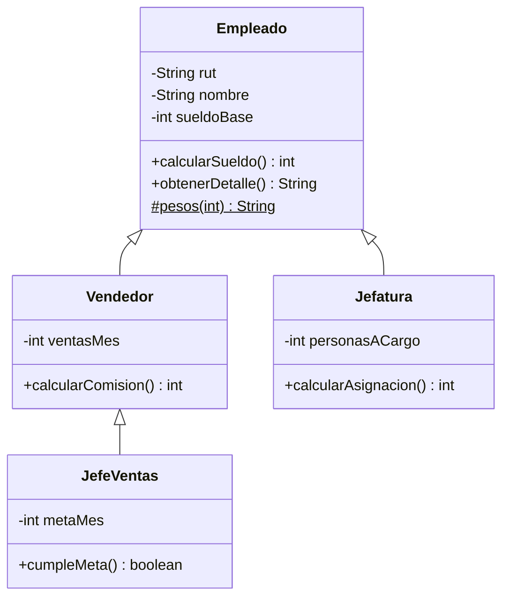

# Guía de resolución · 01 Herencia

Esta guía acompaña la rama `solucion`. Sigue el orden de los requerimientos del [`README.md`](README.md) e indica **qué se hizo** y **por qué**.

> Para comparar tu trabajo con la solución: `git diff main solucion -- puntuales/01-herencia`

## Idea central

La herencia modela una relación **"es un"**: un vendedor *es un* empleado. Todo lo común (RUT, nombre, sueldo base y sus validaciones) se escribe **una sola vez** en `Empleado`. Las subclases solo agregan lo que las diferencia.



## Paso 1 — `Vendedor` (R1)

```java
public class Vendedor extends Empleado {
    private int ventasMes;

    public Vendedor(String rut, String nombre, int sueldoBase, int ventasMes) {
        super(rut, nombre, sueldoBase);   // 1.ª instrucción obligatoria
        setVentasMes(ventasMes);
    }

    @Override
    public int calcularSueldo() {
        return super.calcularSueldo() + calcularComision();
    }
}
```

- **`super(rut, nombre, sueldoBase)`**: `Empleado` no tiene constructor sin parámetros, así que la subclase **debe** llamar explícitamente a uno de los suyos. Si lo omites, el compilador muestra *"constructor Empleado in class Empleado cannot be applied to given types"*.
- Las validaciones del RUT, el nombre y el sueldo mínimo **se heredan gratis**: el constructor de `Empleado` las ejecuta. La prueba `vendedorReutilizaLasValidacionesDeEmpleado` lo comprueba.
- **`super.calcularSueldo()`** llama a la versión de la superclase. Sin `super.`, el método se llamaría a sí mismo y terminaría en `StackOverflowError` (pregunta 2 del enunciado).
- **`@Override`** no es decorativo: si te equivocas en el nombre (`calcularSueldos`), el compilador avisa en vez de crear un método nuevo en silencio.

**Pregunta 1:** `sueldoBase` es `private` en `Empleado`. La subclase lo **tiene** (ocupa memoria en el objeto), pero **no puede accederlo** directamente. Debe usar `getSueldoBase()`. Si quisieras acceso directo, el atributo tendría que ser `protected`, a costa de que cualquier subclase pueda saltarse la validación del setter.

## Paso 2 — `Jefatura` (R2)

Igual al vendedor. La única diferencia es que la asignación necesita el sueldo base, y por eso se lee con el getter:

```java
public int calcularAsignacion() {
    return (int) Math.round(getSueldoBase() * PORCENTAJE_ASIGNACION) + personasACargo * MONTO_POR_PERSONA;
}
```

Los porcentajes y montos son **constantes** (`public static final`). Así las pruebas y el código no repiten números mágicos.

## Paso 3 — `obtenerDetalle()` encadenado

Cada clase **extiende** el detalle de su superclase en vez de reescribirlo:

```java
@Override
public String obtenerDetalle() {
    return super.obtenerDetalle() + " | Comision: " + pesos(calcularComision());
}
```

`toString()` está **solo** en `Empleado` y llama a `obtenerDetalle()` y `calcularSueldo()`. Como esos métodos están sobrescritos, `toString()` produce el texto correcto para cada subclase sin que estas lo redefinan. Este es el patrón *template method*: la superclase fija el formato y las subclases completan las partes.

`pesos(int)` es `protected static`: las subclases lo usan, pero no forma parte de la API pública de un empleado. Usa `Locale.of("es", "CL")` para que el resultado sea `$1.234.567` en cualquier computador. Si se usara el locale por defecto, en un equipo en inglés aparecería `$1,234,567` y las pruebas fallarían.

## Paso 4 — Planilla (R3) y upcasting

```java
Empleado[] planilla = { new Empleado(...), new Vendedor(...), new Jefatura(...), ... };
for (Empleado empleado : planilla) {
    System.out.println(empleado);
}
```

Guardar un `Vendedor` en una variable `Empleado` es **upcasting** y siempre es seguro. En tiempo de ejecución Java invoca el método de la **clase real** del objeto (*despacho dinámico*). Por eso se imprime la comisión aunque la variable sea `Empleado` (pregunta 3). Este es el puente al caso [02 · Polimorfismo](../02-polimorfismo).

## Paso 5 — Desafío `JefeVentas` (R4)

```java
public class JefeVentas extends Vendedor {
    @Override
    public int calcularSueldo() {
        return super.calcularSueldo() + (cumpleMeta() ? BONO_META : 0);
    }
}
```

`super.calcularSueldo()` ahora es el de `Vendedor` (base + comisión), que a su vez llama al de `Empleado`. Cada nivel suma solo lo suyo. `cumpleMeta()` usa `getVentasMes()`, heredado de `Vendedor`.

## Verificación

```bash
mvn test                 # 8 pruebas en verde
mvn compile exec:java    # salida idéntica a la del README
```

## Errores frecuentes

| Síntoma | Causa |
|---|---|
| `constructor Empleado ... cannot be applied to given types` | Falta `super(rut, nombre, sueldoBase)` en el constructor de la subclase. |
| `call to super must be first statement` | Hay código antes de `super(...)`. |
| `sueldoBase has private access in Empleado` | Usa `getSueldoBase()`. |
| `StackOverflowError` | `calcularSueldo()` se llama a sí mismo: falta `super.`. |
| La comisión no aparece en la salida | `obtenerDetalle()` no tiene la firma exacta y no sobrescribe. Agrega `@Override` y el compilador lo detectará. |
