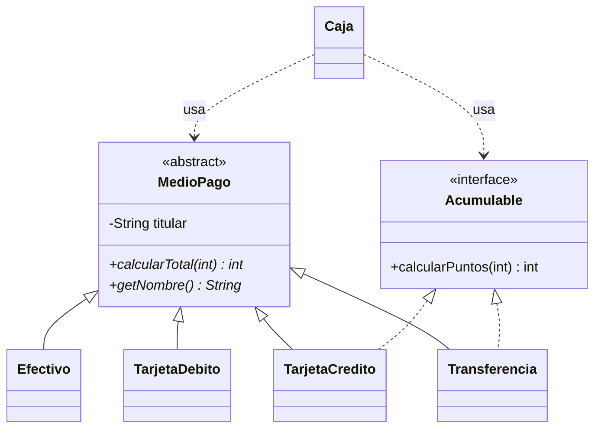

# Guía de resolución · 02 Polimorfismo

> Para comparar tu trabajo con la solución: `git diff main solucion -- puntuales/02-polimorfismo`

## Idea central

**Polimorfismo** significa que una misma llamada (`medio.calcularTotal(monto)`) ejecuta un código distinto según la clase real del objeto. La `Caja` programa contra la **abstracción** (`MedioPago`, `Acumulable`), nunca contra las clases concretas. Por eso acepta medios de pago nuevos sin cambiar.



## Paso 1 — Clase abstracta (R1)

`new MedioPago("Ana")` produce *"MedioPago is abstract; cannot be instantiated"*. Tiene sentido porque un "medio de pago genérico" no sabe calcular un total: `calcularTotal` no tiene cuerpo. La clase abstracta sirve para **dos cosas**:

1. Compartir estado y código común (`titular` y su validación).
2. **Obligar** a cada subclase a implementar `calcularTotal` y `getNombre`. Si una subclase no lo hace, no compila.

## Paso 2 — Las tarjetas (R2)

```java
public class TarjetaCredito extends MedioPago implements Acumulable {
    @Override
    public int calcularTotal(int monto) {
        return (int) Math.round(monto * (1 + INTERES_POR_CUOTA * (cuotas - 1)));
    }

    @Override
    public int calcularPuntos(int totalPagado) {
        return totalPagado / 100;
    }
}
```

- Una clase **hereda de una sola** clase, pero puede **implementar varias** interfaces.
- `cuotas` es `final`: se valida una vez en el constructor y no cambia.
- `totalPagado / 100` es división entera: $61.850 da 618 puntos.

## Paso 3 — La caja (R3)

```java
int total = medio.calcularTotal(monto);            // despacho dinámico
...
if (medio instanceof Acumulable acumulable) {      // pregunta por una capacidad
    int puntos = acumulable.calcularPuntos(total);
    ...
}
```

- La variable `medio` es de tipo `MedioPago`. En tiempo de ejecución la JVM busca `calcularTotal` en la clase real (`Efectivo`, `TarjetaCredito`...). Esto se llama **despacho dinámico** o **enlace tardío**.
- `instanceof Acumulable acumulable` (*pattern matching*, Java 16+) comprueba y convierte en una sola línea. Preguntar por una **interfaz** está bien porque es una capacidad, no un tipo concreto. Cualquier clase futura que implemente `Acumulable` funcionará sin cambios.
- `getBoletas()` retorna `List.copyOf(...)`: quien llama no puede modificar la lista interna (encapsulamiento).

**Pregunta 2:** con una cadena de `instanceof` por clase concreta, cada medio nuevo obliga a abrir `Caja` y agregar una rama. Es fácil olvidar un caso y el compilador no avisa. Con polimorfismo, la lógica de cada medio vive **en su clase**.

## Paso 4 — Desafío `Transferencia` (R4)

Se crea la clase, se agrega una línea en `Main` y **`Caja` no se toca**. Este es el principio **abierto/cerrado**: el código queda abierto a extensión y cerrado a modificación. La prueba `TransferenciaTest` lo verifica.

## Pregunta 3 — ¿Abstracta o interfaz?

| | Clase abstracta | Interfaz |
|---|---|---|
| Atributos de instancia | Sí (`titular`) | No (solo constantes) |
| Constructores | Sí | No |
| Herencia | Una sola | Se pueden implementar varias |
| Uso típico | "Es un" con código común | "Puede hacer" una capacidad |

`MedioPago` podría ser una interfaz, pero cada clase tendría que repetir el atributo `titular` y su validación. Por eso aquí conviene la clase abstracta.

## Verificación

```bash
mvn test                 # 8 pruebas en verde
mvn compile exec:java    # salida idéntica a la del README
```

## Errores frecuentes

| Síntoma | Causa |
|---|---|
| `TarjetaDebito is not abstract and does not override abstract method getNombre()` | Falta implementar un método abstracto. |
| `incompatible types: MedioPago cannot be converted to TarjetaCredito` | Se intentó usar un método propio de la subclase desde una variable `MedioPago`. Usa el método abstracto o una interfaz. |
| Los puntos salen siempre 0 | `TarjetaCredito` no declara `implements Acumulable`, aunque tenga el método `calcularPuntos`. |
