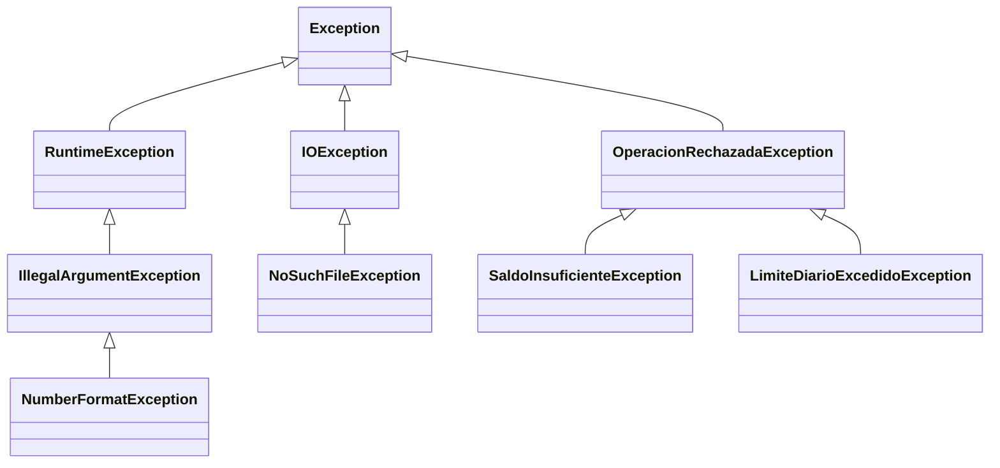

# Guía de resolución · 03 Excepciones

> Para comparar tu trabajo con la solución: `git diff main solucion -- puntuales/03-excepciones`

## Idea central

Una excepción es un **objeto** que interrumpe el flujo normal para avisar que algo no salió como se esperaba. Elegir bien **qué tipo** lanzar le dice a quien llama qué debe hacer:



| Tipo | Hereda de | El compilador obliga a manejarla | Cuándo usarla |
|---|---|---|---|
| **Comprobada** (*checked*) | `Exception` | Sí (`try/catch` o `throws`) | Situaciones esperables que quien llama **debe** decidir cómo resolver: saldo insuficiente, archivo inexistente. |
| **No comprobada** (*unchecked*) | `RuntimeException` | No | Errores de programación o de datos inválidos: monto negativo, `null`, texto que no es número. |

**Pregunta 1:** quedarse sin saldo es parte normal del negocio. El compilador obliga al programador a pensar qué hacer en ese caso. Un monto negativo, en cambio, indica que quien llama no validó su entrada.

## Paso 1 — Excepciones propias (R1)

```java
public class SaldoInsuficienteException extends OperacionRechazadaException {
    private final int faltante;

    public SaldoInsuficienteException(int faltante) {
        super("Saldo insuficiente: faltan " + CuentaBancaria.pesos(faltante));
        this.faltante = faltante;
    }

    public int getFaltante() { return faltante; }
}
```

- Heredar de `OperacionRechazadaException` permite capturar **ambas** reglas con un solo `catch`, o cada una por separado si se necesita.
- La excepción lleva **datos** (`faltante`), no solo texto. Una interfaz gráfica podría ofrecer "¿Girar los $100.000 disponibles?" sin analizar el mensaje.
- El mensaje se arma en el constructor. Así todas las instancias tienen el mismo formato.

## Paso 2 — `girar` (R2)

```java
public void girar(int monto) throws OperacionRechazadaException {
    if (monto <= 0) throw new IllegalArgumentException("El monto debe ser mayor que 0");
    if (monto > saldo) throw new SaldoInsuficienteException(monto - saldo);
    if (giradoHoy + monto > LIMITE_GIRO_DIARIO) throw new LimiteDiarioExcedidoException(LIMITE_GIRO_DIARIO - giradoHoy);
    saldo -= monto;
    giradoHoy += monto;
}
```

- **Validar primero y modificar al final.** Si se descontara el saldo antes de revisar el límite, un giro rechazado dejaría la cuenta inconsistente. La prueba `giroSinSaldoLanzaExcepcionConElFaltante` verifica que el saldo no cambie.
- `throws OperacionRechazadaException` cubre a las dos subclases. `IllegalArgumentException` no necesita declararse, porque es no comprobada.

## Paso 3 — `transferir` (R3)

```java
girar(monto);              // si lanza, la línea siguiente no se ejecuta
destino.depositar(monto);
```

La propia excepción hace que la operación sea atómica: si `girar` falla, el método termina antes de depositar. `transferir` **no captura** nada y solo declara `throws`. Quien conoce el contexto (el procesador) decide qué hacer.

## Paso 4 — `procesar` (R4)

```java
try {
    ejecutar(limpia);
    return "OK | ...";
} catch (OperacionRechazadaException e) {
    return "RECHAZADO | " + limpia + " | " + e.getMessage();
} catch (NumberFormatException e) {      // subclase: va antes
    return "ERROR | ... no es un monto valido";
} catch (IllegalArgumentException e) {   // superclase: va después
    return "ERROR | " + limpia + " | " + e.getMessage();
} finally {
    lineasProcesadas++;
}
```

- **Orden de los `catch`:** Java usa el **primero** que coincida. Si `IllegalArgumentException` fuera antes, atraparía también los `NumberFormatException` y el compilador marcaría el segundo bloque como inalcanzable: *"exception NumberFormatException has already been caught"* (pregunta 2).
- **`finally`** se ejecuta siempre: después del `return` del `try`, después de cualquier `catch` e incluso si ocurre una excepción no capturada. Es el lugar para contar, cerrar o liberar recursos.
- El `switch` con flechas (`case "GIRAR" -> ...`) lanza `IllegalArgumentException` en el `default` para los comandos desconocidos, y así reutiliza el mismo `catch`.

## Paso 5 — `procesarArchivo` (R5)

```java
public List<String> procesarArchivo(Path archivo) throws IOException {
    try (BufferedReader lector = Files.newBufferedReader(archivo)) {
        ...
    }
}
```

- **`try-with-resources`** cierra el `BufferedReader` automáticamente al salir del bloque, con o sin excepción. Reemplaza el antiguo `finally { lector.close(); }`. Funciona con cualquier clase que implemente `AutoCloseable`.
- No hay `catch`: la `IOException` **se propaga** a `Main`, que decide el mensaje al usuario. El procesador no sabe si corre en consola o en JavaFX, y no debería imprimir nada (pregunta 3).
- En `Main`, `catch (NoSuchFileException e)` va antes de `catch (IOException e)` por la misma regla del paso 4.

## Verificación

```bash
mvn test                 # 12 pruebas en verde
mvn compile exec:java    # salida idéntica a la del README
mvn compile exec:java -Dexec.args="no-existe.txt"
```

## Errores frecuentes

| Síntoma | Causa |
|---|---|
| `unreported exception OperacionRechazadaException; must be caught or declared to be thrown` | Llamas a `girar` sin `try/catch` ni `throws`. Es el compilador haciendo su trabajo. |
| `exception NumberFormatException has already been caught` | Orden de los `catch` invertido. |
| `catch (Exception e)` en todas partes | Funciona, pero oculta errores de programación (`NullPointerException`) y no distingue *rechazado* de *error*. Captura lo más específico posible. |
| `e.printStackTrace()` como única acción | El usuario no entiende la traza. Muestra `e.getMessage()` y deja la traza para depurar. |
| El saldo baja aunque el giro se rechaza | Se modifica el estado antes de terminar de validar. |
